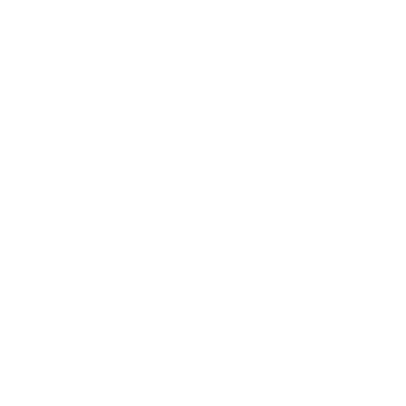

<div align="center">

# 🎲 Dice

**A two-dice roller built with Flutter — tap either die to re-roll it.**



[](https://flutter.dev)
[](https://dart.dev)
[](LICENSE)

</div>

---

## 🇬🇧 English

A playful two-dice roller from my early days of learning Flutter. Tapping either die re-rolls it independently — a small app, but one that taught me the core mental model of Flutter: **the UI is a function of state**. The dice number is state, `setState` mutates it, and the framework rebuilds the tree.

This repo has since been cleaned up: state updates were extracted into small, intention-revealing methods, `print` debugging was removed, and the widget tree is now fully `const`-friendly.

### ✨ What's inside

| Concept | Where it lives |
|---|---|
| `StatefulWidget` + `setState` | `lib/main.dart` |
| `Random` number generation (`dart:math`) | `lib/main.dart` |
| `Row` / `Expanded` flexible layout | `lib/main.dart` |
| Composing images dynamically with string interpolation | `Image.asset('images/dice$_n.png')` |
| A smoke test that taps a die | `test/widget_test.dart` |

### 🚀 Run it

```bash
flutter pub get
flutter run
```

### 🧪 Test it

```bash
flutter test
```

---

## 🇮🇷 فارسی

یک تاس‌انداز دو‌تایی از روزهای اول یادگیری‌ام با Flutter. با لمس هر تاس، همان تاس به‌صورت مستقل دوباره ریخته می‌شود — اپ کوچکی است، ولی مهم‌ترین مدل ذهنی فلاتر را به من یاد داد: **رابط کاربری تابعی از وضعیت (state) است**. شمارهٔ تاس state است، `setState` آن را تغییر می‌دهد و فریمورک درخت ویجت‌ها را دوباره می‌سازد.

این ریپو بعدها مرتب و بازنویسی شده است: به‌روزرسانی وضعیت به متدهای کوچک و گویا منتقل شده، `print`های دیباگ حذف شده و درخت ویجت‌ها بهینه (const-friendly) شده است.

### ✨ چه چیزهایی در آن هست

| مفهوم | محل استفاده |
|---|---|
| `StatefulWidget` و `setState` | `lib/main.dart` |
| تولید عدد تصادفی با `dart:math` | `lib/main.dart` |
| چیدمان انعطاف‌پذیر `Row` / `Expanded` | `lib/main.dart` |
| ساخت مسیر تصویر به‌صورت پویا | `Image.asset('images/dice$_n.png')` |
| تست اسموک با لمس تاس | `test/widget_test.dart` |

### 🚀 اجرا

```bash
flutter pub get
flutter run
```

---

<div align="center">

**Built with Flutter · Maintained by [Parsa Fathi](https://github.com/ParsaFathii)**

</div>
